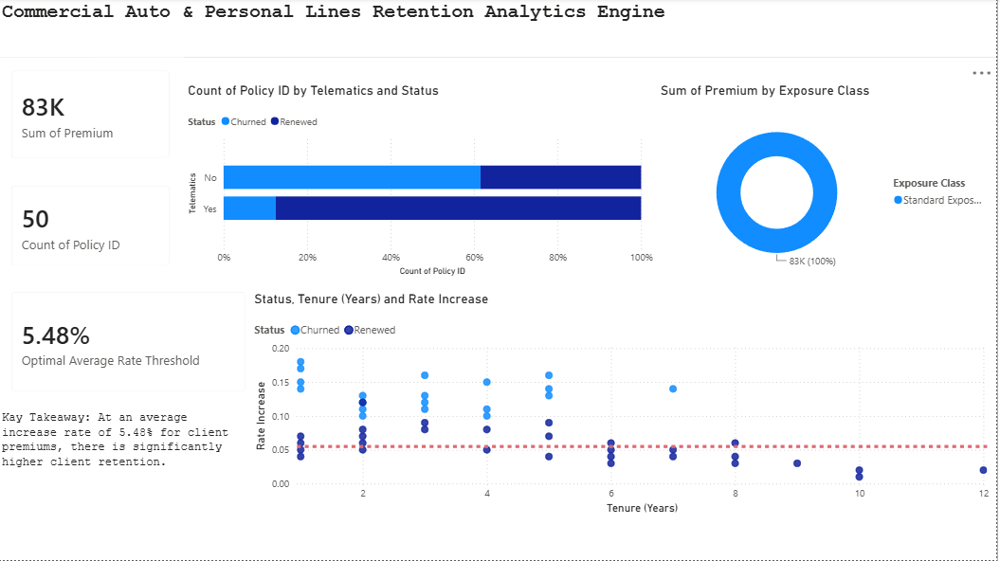

# Commercial Auto Telematics Churn & Price Sensitivity Calculator

## Project Overview
This project provides an automated, end-to-end data pipeline designed to analyze commercial auto insurance policyholder retention and evaluate price elasticity. The core engine processes operational data to identify the exact threshold where premium price hikes trigger client churn, helping underwriters optimize pricing structures without sacrificing customer loyalty.

## Interactive Analytics Dashboard
 

## Features & Tech Stack
* **Automated Staging Layer (Excel VBA)**: Utilizes memory-efficient dynamic arrays to scrub and process transaction records, completely isolating successful renewals without corrupting original source tables.
* **Actuarial Modeling (VBA Logic)**: Dynamically computes the portfolio's **Optimal Average Premium Rate Increase Ceiling (5.48%)**, mapping out the boundary lines of customer sensitivity.
* **Business Intelligence Frontend (Power BI)**: Delivers interactive dashboards capturing distinct policyholder metrics, including executive KPI cards, 100% stacked telematics performance metrics, and a clean scatter plot displaying pricing hazard zones.

## Business Key Takeaway
The data engine proves a strict pricing boundary across personal and commercial automobile profiles. Rate adjustments kept below the **5.48% optimal premium threshold** yield excellent client retention. However, adjustments exceeding this ceiling heavily accelerate risk exposure and customer churn, particularly for clients not participating in the telematics initiative.
