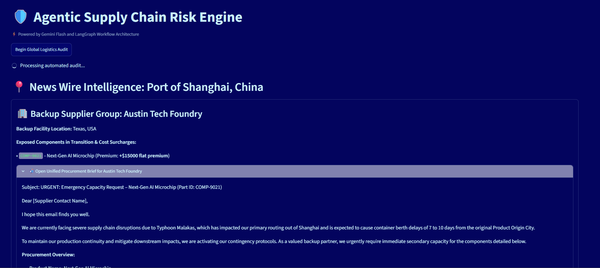

# Agentic AI Supply and Risk Disruption Planner

## Project Overview
This project employs a multi-agent AI framework to support supply chain activities. Three agents, the impact analyst, and the planner are created using Google Gemini model 3.5 Lite. The agent's operate as follows:
- **The monitor** - analyzes various news articles and summarizes the news
- **The impact analyst** - cross-references the origin city of a supplier with the news bulletin
- **The planner agent** - Drafts a procurement email to backup suppliers

The resulting output is a dropdown list of affected ports, impact summary, and an auto-generated procument email to backup supplier for affected product(s).

## Interactive Analytics Dashboard
 

## Features & Tech Stack
* **Agentic AI** - Google Gemini Model 3.5-lite
* **StreamLit** - Used to create interactive Dashboard

## Business Key Takeaway
This multi-agent framework simplifies the process of analyzing which suppliers are affected by external events and shortens the response time by automatically tracking affected products.
